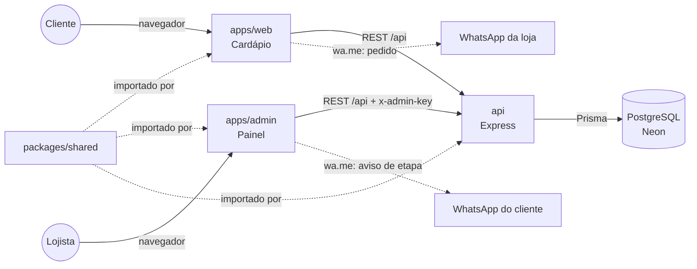
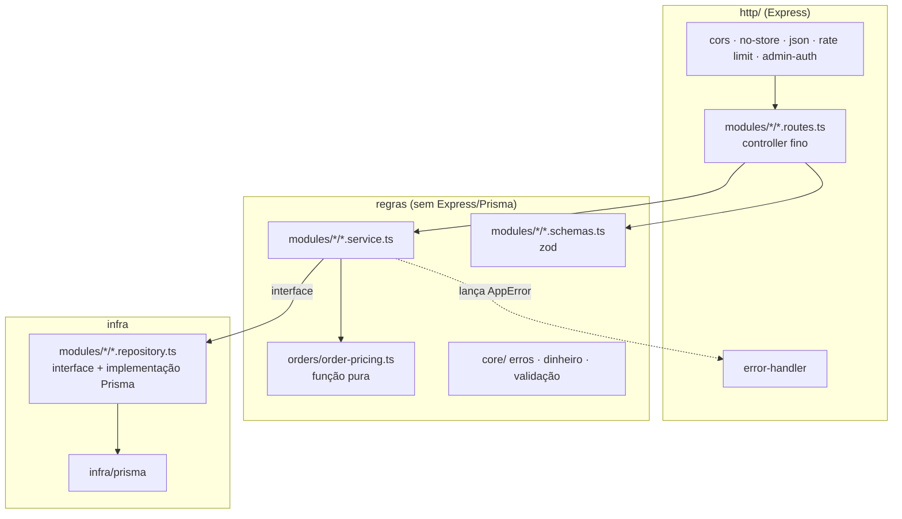
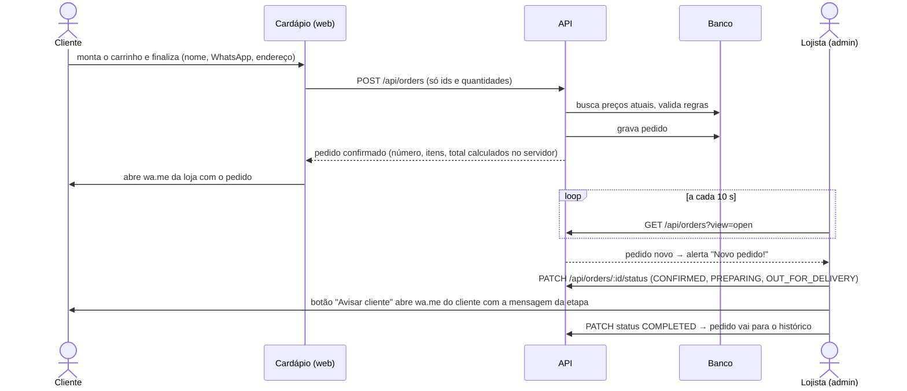

# Arquitetura

## Visão geral



- **Três aplicações, uma API.** O cardápio e o painel são apps React separados
  (públicos e necessidades de autenticação diferentes) que consomem a mesma API.
- **`packages/shared`** guarda tudo o que precisa dar o mesmo resultado nos três
  lugares: cálculo de preço em centavos, etapas do pedido, regras do cardápio,
  validação de telefone, textos das mensagens do WhatsApp e o cliente HTTP.
  É TypeScript puro (sem React, sem Express), consumido como código-fonte: o Vite
  compila direto nos fronts e o `tsup` o embute no bundle da API.
- **WhatsApp sem API paga.** O envio é por links `wa.me` que abrem o WhatsApp com
  a mensagem pronta (ver [REGRAS-DE-NEGOCIO](REGRAS-DE-NEGOCIO.md#whatsapp)).

## Camadas da API



| Camada | Responsabilidade | Não pode |
|---|---|---|
| `*.routes.ts` | Receber a requisição, chamar `parse*` e o service, responder | Ter regra de negócio |
| `*.schemas.ts` | Validar e normalizar a entrada com zod, com mensagens em pt-BR | Acessar banco |
| `*.service.ts` | Regras de negócio; recebe repositórios pelo construtor | Importar Express ou Prisma |
| `*.repository.ts` | Interface + implementação Prisma; converte `Decimal` → `number` | Ter regra de negócio |
| `core/` | `AppError` e subclasses, conversão de dinheiro, helpers de validação | Depender de framework |
| `http/` | Middlewares e o **único** ponto que traduz erros em status HTTP | — |
| `container.ts` | *Composition root*: decide as implementações concretas | — |

**Inversão de dependência.** `createApp(deps)` recebe config, services e health
check prontos; `server.ts` monta tudo com Prisma. Nos testes, `createTestApp()`
monta o mesmo app com **repositórios em memória** e um relógio fixo — as rotas e
os services reais são exercitados sem banco e sem `vi.mock`.

**Erros.** Services lançam `ValidationError` (400), `UnauthorizedError` (401),
`ForbiddenError` (403), `NotFoundError` (404), `ConflictError` (409) ou
`ServiceUnavailableError` (503). Erros conhecidos do Prisma são traduzidos em
`infra/prisma/prisma-errors.ts` (P2025 → 404, P2002/P2003 → 409). Tudo sai como
`{ "error": "mensagem" }`.

## Camadas dos fronts

```
config/env.ts  -> único ponto que lê import.meta.env (VITE_*)
api/           -> um gateway por recurso sobre createHttpClient (@baruk/shared)
domain/        -> regras puras e testadas (carrinho, mensagens, validação, formatação)
hooks/         -> orquestram domínio + api + estado React
context/       -> estado compartilhado (web: carrinho com useReducer)
components/    -> apresentação: dados e callbacks por props
pages/         -> composição de uma tela
```

Componentes não chamam `fetch` nem contêm regra; usam hooks, que usam `domain/`
e `api/`. Detalhes em [FRONTENDS](FRONTENDS.md).

## Fluxo de um pedido



Se a API estiver fora do ar no checkout, o pedido **ainda segue pelo WhatsApp**
com os valores do carrinho (sem número); se a API **recusar** o pedido (cardápio
mudou, promoção fora do dia...), o motivo aparece na tela e nada é enviado.

## Decisões de design

| Decisão | Motivo |
|---|---|
| O navegador envia só ids e quantidades; o servidor calcula tudo | Preço não pode ser manipulado pelo cliente |
| Dinheiro em centavos no código, `DECIMAL(10,2)` no banco | Evitar erros de ponto flutuante (0,1 + 0,2) |
| Mesma função de preço (`unitPriceCents`) no front e na API | O valor mostrado é sempre o cobrado |
| Número de pedido sequencial (`#0042`) além do id | Identificação humana no balcão e no WhatsApp |
| Status só avança (pode pular etapas) | Histórico coerente; atalho para retirada no balcão |
| Polling de 10 s no painel em vez de WebSocket | Simples, sem infraestrutura extra; volume de uma pizzaria |
| Avisos por link `wa.me` em vez da API oficial | Custo zero e sem risco de banimento; textos prontos para migrar |
| Uma chave administrativa (`ADMIN_API_KEY`) em vez de usuários | Loja com um operador; ver limitações em [ESTADO-ATUAL](ESTADO-ATUAL.md) |
| `Cache-Control: no-store` em toda a `/api` | Preços e pedidos mudam a qualquer momento |
