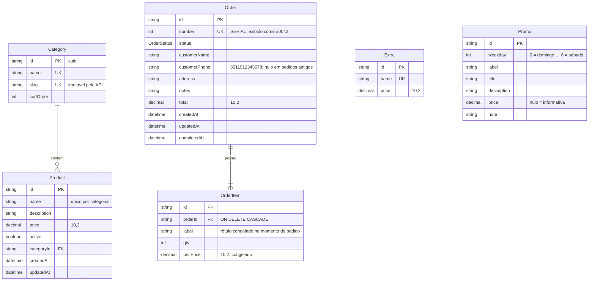

# Banco de dados

PostgreSQL (hospedado no **Neon** em desenvolvimento), acessado pelo Prisma 5.
Schema em [`api/prisma/schema.prisma`](../api/prisma/schema.prisma).

## Modelo

`OrderStatus`: `RECEIVED`, `CONFIRMED`, `PREPARING`, `OUT_FOR_DELIVERY`, `COMPLETED`.

Índices extras em `Order`: `(status, createdAt)` para a fila e `(completedAt)`
para o histórico.

## Convenções

- **Dinheiro** é `DECIMAL(10,2)` no banco. Os repositórios convertem para
  `number` (`core/money.ts`) e todo cálculo é feito em centavos.
- **`OrderItem` não referencia `Product`** de propósito: guarda o rótulo e o preço
  do momento do pedido. Alterar ou excluir um produto não muda pedidos antigos.
- **`Order.number`** vem de uma sequência (`SERIAL`); pode ter lacunas se uma
  transação falhar.
- **Ids** são `cuid()` gerados pelo Prisma.

## Migrações

Ficam em `api/prisma/migrations/`, aplicadas em ordem:

| Migração | O que faz |
|---|---|
| `20260928223114_init` | Tabelas iniciais (preços como `DOUBLE PRECISION`) |
| `20260929230000_money_decimal` | Converte todos os valores monetários para `DECIMAL(10,2)` (arredondando para 2 casas) |
| `20260930120000_order_management` | Enum `OrderStatus`; `number`, `status`, `updatedAt`, `completedAt` e índices em `Order` |
| `20260930150000_order_delivery_steps` | Etapas `CONFIRMED` e `OUT_FOR_DELIVERY`; coluna `customerPhone` |

Como criar e aplicar migrações com segurança está em
[DESENVOLVIMENTO](DESENVOLVIMENTO.md#migrações-leia-antes).

## Seed

`npm run db:seed` executa [`api/prisma/seed.ts`](../api/prisma/seed.ts) numa
transação:

- 4 categorias: Tradicionais, Especiais, Doces, Bebidas;
- 32 produtos (sabores e refrigerantes) e 13 adicionais — por `upsert`: roda de
  novo sem duplicar e **restaura os preços do seed**;
- 7 promoções, uma por dia da semana — **apaga e recria** todas as promoções.

Não mexe em pedidos. Atenção: rodar o seed em produção desfaz preços alterados
pelo painel.
