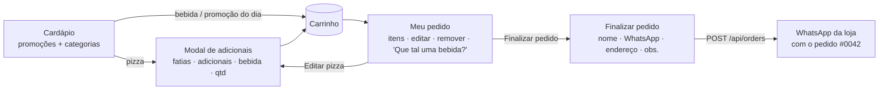

# Frontends

Dois apps React 18 + Vite 5 + TypeScript, sem biblioteca de UI nem de estado:
CSS próprio com variáveis e estado com hooks/`useReducer`. Os dois seguem a
mesma organização (ver [ARQUITETURA](ARQUITETURA.md#camadas-dos-fronts)).

## Cardápio do cliente — `apps/web`

Porta 5173. Identidade visual escura com dourado (fontes Cinzel, Pinyon Script e
Lato) e acentos em vermelho/verde da bandeira italiana. Mobile first.

### Telas e fluxo

- **Cardápio** (`pages/MenuPage.tsx`): cabeçalho, navegação por seções que
  acompanha a rolagem (`useActiveSection`), promoções (botão de compra só na
  promoção do dia), trilhos de produtos por categoria (bebidas por último).
- **Modal de adicionais** (`AddOnsModal` + `usePizzaBuilder`): fatias,
  adicionais, bebida acompanhante e quantidade, com preço atualizado ao vivo. O
  mesmo modal edita um item já no carrinho ("Salvar alterações").
- **Carrinho** (`components/cart/`): tela "Meu pedido" em tela cheia no celular e
  painel lateral no desktop; itens com miniatura, detalhes, ✕ remover, ✎ editar,
  seletor de quantidade e subtotal; sugestão de bebidas; resumo e "Finalizar
  pedido", que leva ao formulário de entrega.
- **Checkout** (`useCheckout`): valida os dados, registra na API e abre o
  WhatsApp da loja. API fora do ar → envia assim mesmo, sem número; API recusou →
  mostra o motivo e não envia.

### Organização

| Pasta | Conteúdo |
|---|---|
| `api/` | `menu-api.ts` (`fetchMenu`), `orders-api.ts` (`submitOrder`) |
| `domain/cart.ts` | Tipos do carrinho, `cartReducer` (add, changeQty, remove, replace, clear), totais em centavos, `toOrderItems` |
| `domain/cart-lines.ts` | Montagem das linhas: `pizzaLine`, `drinkLine`, `promoLine` (chave, rótulo, título, detalhes, preço) |
| `domain/menu.ts` | `organizeMenu`, promoção do dia, `drinkVolume` ("2L") |
| `domain/whatsapp.ts` | Validação do cliente e mensagem do pedido para a loja |
| `context/CartContext.tsx` | Estado do carrinho (`useReducer`) — sem regras |
| `hooks/` | `useMenu`, `useCheckout`, `usePizzaBuilder`, `useActiveSection` |
| `components/` | Apresentação; `cart/` guarda as peças do carrinho; `icons.tsx` tem os ícones SVG |

Linhas iguais do carrinho (mesma pizza, fatias, adicionais e bebida) se somam
pela `key`. O carrinho vive só na memória: recarregar a página esvazia.

## Painel do lojista — `apps/admin`

Porta 5174. Visual claro, sóbrio. Protegido pela chave administrativa.

### Seções

- **Login** (`pages/LoginPage.tsx`): valida a chave em `POST /api/admin/session`
  e guarda no `sessionStorage` (`auth/admin-session.ts`). Ao reabrir o painel a
  chave salva é revalidada.
- **Pedidos** (`pages/OrdersPage.tsx`), aba padrão:
  - abas **Em aberto** (fila, mais antigos primeiro) e **Histórico**;
  - busca por número (`#0042`) ou nome do cliente, paginação de 20;
  - cartão por pedido com número, cliente, itens, horário, tempo de espera
    ("há 12 min"), status e total; ao abrir: itens, WhatsApp, endereço,
    observações, horários;
  - botões da próxima etapa + "Concluir pedido";
  - botão verde **Avisar cliente no WhatsApp** nas etapas que avisam;
  - atualização automática a cada 10 s (`usePolling`, pausa com a aba oculta).
- **Alerta de pedido novo** (`useNewOrderAlert`): em qualquer seção, compara o
  `latestOrderNumber` entre consultas, mostra "Novo pedido!" com contador e o
  número no título da aba.
- **Cardápio** (`pages/ProductsPage.tsx`): cadastrar item (categoria existente ou
  nova), editar preço por linha (salva no botão "Salvar"), excluir.

### Organização

| Pasta | Conteúdo |
|---|---|
| `api/` | `http.ts` (injeta `x-admin-key`), `auth-api`, `orders-api`, `products-api`, `categories-api`, `extras-api`, `promos-api` |
| `domain/orders.ts` | Botões de etapa (`statusActions`), link de aviso (`customerNotificationLink`), datas no fuso de São Paulo, tempo de espera, contagem de pedidos novos |
| `domain/products.ts` | Validação do formulário, conversão de preço digitado, agrupamento por categoria |
| `hooks/` | `useAdminAuth`, `useOrders`, `useNewOrderAlert`, `useProducts`, `usePolling` |

`categories-api`, `extras-api` e `promos-api` já existem, mas **ainda não têm
tela** (ver [ESTADO-ATUAL](ESTADO-ATUAL.md)).

## Variáveis de ambiente

| App | Variável | Uso |
|---|---|---|
| web | `VITE_API_URL` | Endereço da API (padrão `http://localhost:3001`) |
| web | `VITE_WHATSAPP_NUMBER` | WhatsApp da loja, só dígitos com DDI (ex.: `5511912345678`) |
| admin | `VITE_API_URL` | Endereço da API |

Variáveis `VITE_*` vão para o JavaScript público: **nunca** coloque segredos nelas
(a chave administrativa é digitada no login, nunca embutida no build).
