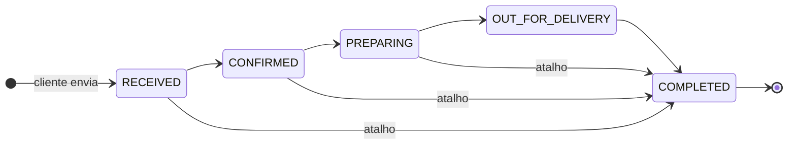

# Regras de negócio

Onde cada regra mora está indicado entre parênteses. Regras em
`packages/shared` valem igual para API, cardápio e painel.

## Cardápio

- **Categorias** têm nome, `slug` e ordem de exibição (`sortOrder`). O slug é
  gerado do nome (sem acentos, minúsculo, com hífens) e **não pode ser alterado**
  depois (`categories.schemas.ts`), porque regras dependem dele.
- **Categoria de bebidas** é a de slug `bebidas` (`isDrinkCategory`,
  `shared/menu-rules.ts`). No cardápio ela aparece por último e alimenta a lista
  "acompanha uma bebida?" e o "Que tal uma bebida?" do carrinho.
- **Produto inativo** (`active: false`) some do cardápio e é recusado em pedidos.
- Criar produto informando `categoryName` reaproveita a categoria de mesmo slug
  ou cria uma nova no fim da lista (`sortOrder` 999).
- Não é possível excluir categoria com produtos (409).
- **Preços** de produtos, adicionais e promoções: de R$ 0,01 a R$ 9.999,99, com
  no máximo duas casas decimais (`isValidPrice`, `shared/pricing.ts`).

## Preço de um item

```
preço unitário = produto + soma dos adicionais + bebida acompanhante
total da linha = preço unitário × quantidade
```

Calculado **em centavos** por `unitPriceCents` (`shared/pricing.ts`). O cardápio
usa a função para exibir; a API usa a mesma para cobrar, sempre com os preços
**atuais do banco** — o navegador só envia ids e quantidades
(`orders/order-pricing.ts`).

## Montagem da pizza

- Fatias: **8** ou **12** (não muda o preço).
- Até **10 adicionais** por pizza, sem repetir.
- Uma **bebida acompanhante** opcional, que precisa ser da categoria bebidas.
- Uma **bebida pedida sozinha** não aceita adicionais nem outra bebida.
- Pizza não pode ser usada como "bebida acompanhante".

## Promoções

- Cada promoção pertence a um **dia da semana** (0 = domingo … 6 = sábado).
- **Promoção com preço** vira um item do carrinho, mas **só no próprio dia**, no
  fuso de São Paulo (`weekdayInSaoPaulo`). O cardápio só mostra o botão de compra
  no dia; a API recusa em outro dia ("Essa promoção não está disponível hoje.").
- **Promoção sem preço** (ex.: "borda grátis") é só informativa: o cliente pode
  marcá-la como "aplicada", e isso aparece na mensagem do WhatsApp. **O sistema
  não calcula desconto** — a loja aplica no atendimento.

## Pedido

Limites validados pela API (`orders.schemas.ts`):

| Campo | Regra |
|---|---|
| Nome | obrigatório, até 100 caracteres |
| WhatsApp | obrigatório, telefone brasileiro válido (ver abaixo) |
| Endereço | obrigatório, até 300 caracteres |
| Observações | opcional, até 500 caracteres |
| Itens | de 1 a 30; quantidade de 1 a 30 por item |
| Total | até R$ 99.999.999,99 |

Cada item é **um produto** (com fatias, adicionais e bebida) **ou uma promoção
do dia** — nunca os dois. Se algum produto/adicional/promoção não existir mais ou
estiver inativo, a API responde: "O cardápio mudou ou contém uma opção
indisponível. Atualize a página e tente novamente."

O pedido recebe um **número sequencial** exibido como `#0042`
(`formatOrderNumber`). A numeração pode ter lacunas se uma gravação falhar.

**Limite de envio:** 10 pedidos a cada 15 minutos por IP.

## Etapas do pedido



| Status | Rótulo | Aviso ao cliente |
|---|---|---|
| `RECEIVED` | Recebido | — |
| `CONFIRMED` | Confirmado | ✅ |
| `PREPARING` | Em preparo | ✅ |
| `OUT_FOR_DELIVERY` | Saiu para entrega | ✅ |
| `COMPLETED` | Concluído | — |

- O status **só avança**; pode pular etapas, nunca voltar ou repetir
  (`canChangeOrderStatus`, `shared/orders.ts`). Tentativa inválida → 409.
- No painel, cada pedido mostra a **próxima etapa** em destaque e um atalho
  "Concluir pedido" (útil para retirada no balcão).
- Concluir grava `completedAt` e move o pedido da **fila** (mais antigos
  primeiro) para o **histórico** (concluídos mais recentes primeiro).

## Telefone

`normalizeBrazilianPhone` (`shared/whatsapp.ts`) aceita qualquer formatação
("(11) 91234-5678", "+55 11 91234 5678"...) e guarda só dígitos com DDI:
`5511912345678`.

- Celular: DDD + 9 + 8 dígitos. Fixo: DDD + 8 dígitos começando com 2–5.
- DDD não pode começar com 0; número sem DDD é recusado.
- Pedidos anteriores à existência do campo têm telefone nulo.

## WhatsApp

Tudo é feito com links `https://wa.me/<telefone>?text=<mensagem>` — abrem o
WhatsApp de quem clica com a conversa e o texto prontos; **nada é enviado
automaticamente**.

| Momento | Quem clica | Para quem | Conteúdo |
|---|---|---|---|
| Checkout | Cliente | Loja (`VITE_WHATSAPP_NUMBER`) | Número do pedido, itens, total, promoção, nome, telefone, endereço, observações |
| Etapas Confirmado / Em preparo / Saiu para entrega | Lojista (botão no painel) | Cliente | Mensagem da etapa (`customerStatusMessage`) |

Os textos ficam em `packages/shared/src/whatsapp.ts`. Para envio automático
(API oficial WhatsApp Business Cloud, da Meta), a API chamaria a mesma
`customerStatusMessage` ao mudar o status — ver [ESTADO-ATUAL](ESTADO-ATUAL.md).

## Painel do lojista

- Acesso por uma **chave administrativa** única (`ADMIN_API_KEY`, mínimo 32
  caracteres; sem ela as rotas administrativas respondem 503). A chave fica no
  `sessionStorage` do navegador e some ao fechar a aba.
- Tentativas de login: 10 a cada 15 minutos por IP.
- A fila atualiza sozinha a cada 10 s; pedidos novos geram um alerta com
  contador, em qualquer seção do painel, e aparecem no título da aba.
